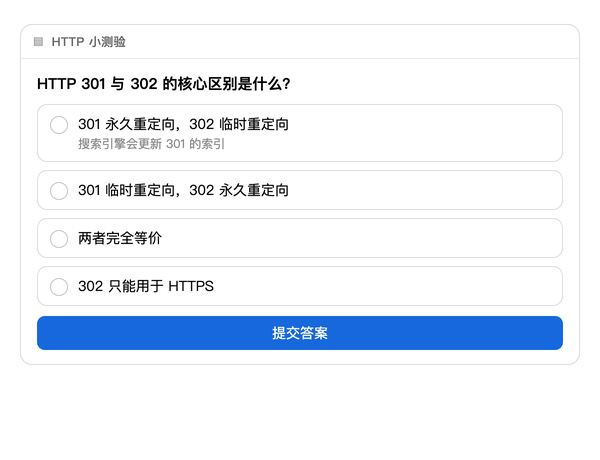
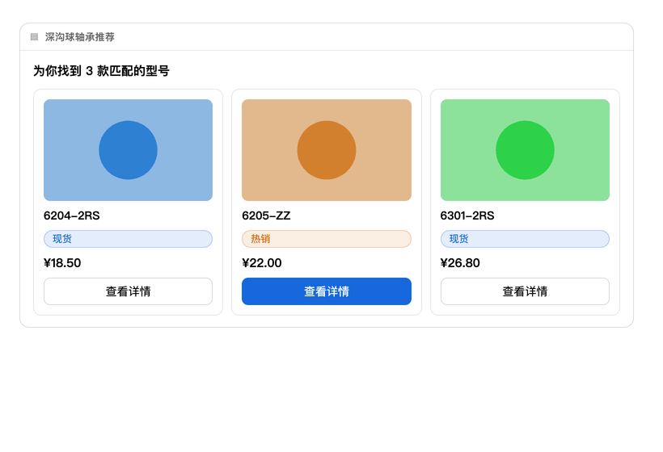

# a2ui-render-in-dsh Feature Showcase

English | [中文](DEMO.zh.md)

Each demo shows: **what you say to dsh → the card the model renders → what you do on the card → what comes back to the conversation**. All GIFs/screenshots are recorded from real chromium rendering.

To reproduce locally: install the plugin ([README → Installation](README.md#installation)), then send each section's prompt to dsh — whether to render a card is the model's adaptive call, and these prompts trigger it reliably.

---

## 1. Interactive quizzes (learning / testing)

> 💬 "Quiz me with an interactive card: what's the difference between HTTP 301 and 302?"

The model renders a multiple-choice card → pick an option → click Submit → the answer returns as a plain-language message (`Submit answer: 301 is permanent, 302 is temporary`) → the model grades and explains. **The card locks after submission**: options stay highlighted but frozen, and the footer records what was submitted and when. Reloading the page restores the locked state and selections.



## 2. Forms (dropdown single/multi select, input, checkbox)

> 💬 "Build a course signup form: name input, city dropdown (single, default Beijing), track dropdown (multi, max 2), and an agreement checkbox"

`Select` supports single select (stores the value) and multi select (stores an array, cap via `maxAllowedSelections`), option descriptions, per-option disabling (e.g. "Guangzhou (not yet open)"), and preselection via `dataModel`. The submission is a multi-line plain-language summary:

```
Submit signup
City: Shanghai
Tracks: Backend, Data Analysis
Agree to terms: yes
```


## 3. Product cards (multi-column + query buttons)

> 💬 "Recommend three mechanical keyboards as three side-by-side product cards, each with a View Details button"

One call + `Grid` lays out equal-width columns. **Buttons on cards without input components are auto-detected as query buttons** — they stay clickable forever (each click sends `View details: SKU-00x`), unlike form submissions which lock.



## 4. Charts & dashboards

> 💬 "Draw a 2×2 ops dashboard: visits line chart, orders bar chart, channel share donut, conversion area chart"

`Chart` passes a standard ECharts option through verbatim; `Grid columns: 2` makes it a dashboard.


## 5. Math function plots

> 💬 "Plot y=tan(x), cot(x), sec(x), csc(x)"

The model only writes expressions (`functions: [{"expr": "tan(x)"}]`); a built-in **safe expression evaluator** (whitelisted math functions, no eval) samples ~400 points and breaks lines at asymptotes — the model never hand-enumerates data points (which would inevitably fail).


## 6. Flowcharts / mind maps / sequence diagrams (Mermaid)

> 💬 "Draw a user-registration flowchart and a frontend-skills mind map"

The `Mermaid` component covers every Mermaid diagram type — flowchart, mindmap, sequenceDiagram, gantt, pie, stateDiagram — with automatic light/dark theming.

## 7. Math formulas (KaTeX)

> 💬 "Show the normal distribution density function" / "Animate matrix multiplication (state the equation first)"

The `Math` component renders LaTeX (fonts inlined into the plugin, zero external requests). Matrices are forced into formula rendering — the catalog forbids raw nested arrays like `[[2,1],[0,3]]` in text.

Combined rendering in light and dark themes (formula + chart + flowchart + mind map + quiz on one card):

| Light | Dark |
|---|---|
|  |  |

## 8. Algorithm animation · array/bars form

> 💬 "Animate quicksort on [7,2,9,4,1,8,3]"

The model simulates the algorithm into per-step frames; the plugin plays them as smoothly-morphing gradient bars: orange = being compared/swapped, green = finalized, with per-frame captions, a progress bar, and a legend. **Each card auto-plays exactly once per tab** (component remounts never replay); after finishing, the button becomes ↻ — one click, one replay. Pause, stepping, and reset included.


## 9. Algorithm animation · grid/matrix form

> 💬 "Animate matrix multiplication [[2,1],[0,3]] × [[1,4],[5,2]]"

Multiple matrices side by side, computed cell by cell: orange = row/column being read, green = the cell being written, with per-frame equations (`C[0][1] = 1×7 + 2×8 = 23`). Also suits DP-table filling and other 2D processes.


## 10. Fullscreen zoom (mind maps / flowcharts / charts / images)

Hover reveals ⛶ → fullscreen with automatic fit-to-viewport scaling → wheel zoom (0.2×–10×) + drag panning → exit via Esc/✕. Charts re-render at fullscreen size (vector-crisp).


---

## One-stop prompt list

Send these to dsh in order to reproduce everything above:

1. Quiz me with an interactive card: the difference between HTTP 301 and 302
2. Build a course signup form: name input, city dropdown (default Beijing), track dropdown (multi, max 2), agreement checkbox
3. Recommend three mechanical keyboards as three side-by-side product cards with View Details buttons
4. Draw a 2×2 ops dashboard: visits line, orders bar, channel donut, conversion area chart
5. Plot y=sin(x) vs y=cos(x) on one chart, and show Euler's identity
6. Draw a user-registration flowchart and a frontend-skills mind map
7. Animate bubble sort on [5,2,8,1,9]
8. Animate matrix multiplication [[1,2],[3,4]] × [[5,6],[7,8]], stating the full equation first
