# a2ui-render-in-dsh 功能示例

[English](DEMO.md) | 中文

每个示例都展示完整闭环：**你对 dsh 说什么 → 模型渲染什么卡片 → 你在卡片上做什么 → 会话里收到什么**。所有动图/截图均来自 chromium 真实渲染录制。

本地复现：先安装插件（[README → 安装](README.zh.md#安装)），再把每节的提示词发给 dsh。是否出卡由模型自适应判断，判断锚定 UI 的四个目的——**操作**（要填/要选）、**浏览**（想看/扫数据）、**理解**（结构/记号/动态过程）、**反馈**（长任务状态）——下面所有提示词都**不含**"卡片""图表"等任何 UI 字眼。

---

## 第一部分 · 生活各面，一面一例

### 📚 学习 —— 选项就是公式的做题卡

> 💬 "给我出一道微积分小题练练手"

**命中目的：操作 + 理解。** 模型渲染选择题卡，选项是真正的 KaTeX 公式（$\frac{x^2}{2}+C$ …），题干下还有公式提示。选中 → 提交 → 整卡锁定，底部记录**以公式渲染**的已提交答案和时间，"重新填写"可解锁重来；答案以自然语言回传给模型判分。

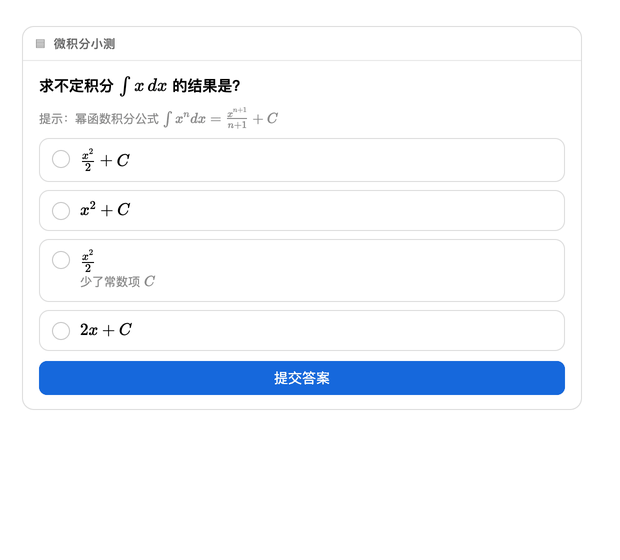

### 🏡 生活 —— 订一间周末民宿

> 💬 "周末想去莫干山泡温泉，帮我订个民宿"

**命中目的：操作。** 预订表单：月视图 `Calendar` 选入住日期（今天之前自动禁用）、房型单选（带价格）、接站勾选。提交一次即整卡锁定并留记录，提交内容是可读的多行自然语言，不是 JSON。

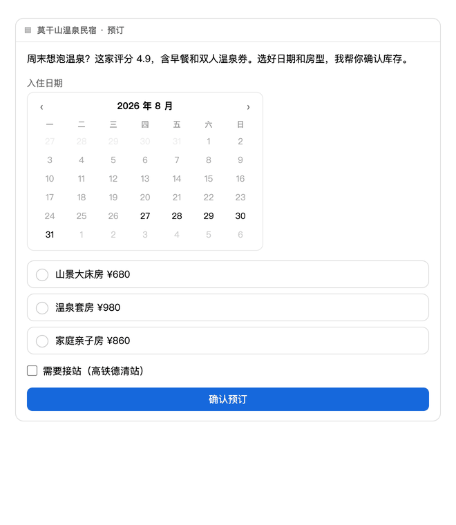

### 💼 工作 —— 看得见进度的长任务

> 💬 "盯一下我们三家竞品这周的价格变化，整理个汇总"

**命中目的：反馈。** 模型动手前先渲染 `Progress` + `Steps` 进度卡，随后用 `a2ui_update` **原地推进**——进度条真的在动（10% → 45% → 80% → 100%），步骤逐个变绿，最终汇总表直接落进同一张卡（可排序、可复制/导出 CSV）。更新会持久化，刷新页面后自动重放。

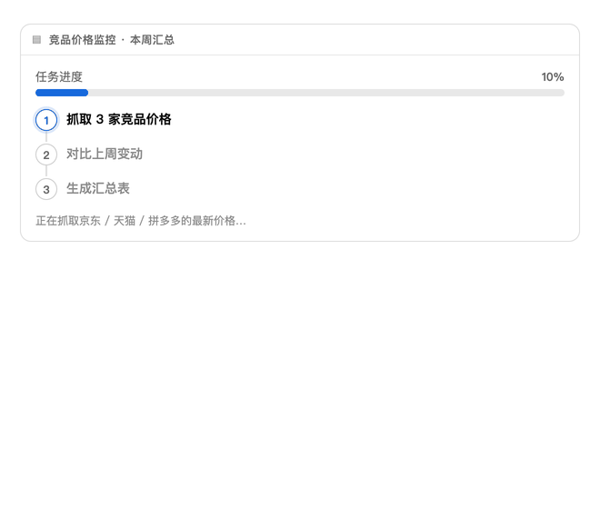

### 📊 数据 —— "我就是想看一眼"

> 💬 "我想看一些2026年上半年各省GDP"

**命中目的：浏览。** 看数据的请求本身就是出图请求——不需要说"图表"两个字。模型把 KPI `Stat` 指标块 + 中国地图 `Map` 热力 + 交互 `Table` 组合进一张卡：点表头排序（识别数字）、筛选框输入即过滤、一键复制 TSV / 导出 CSV。数据滞后或近似也不取消卡片——模型会标注口径并在正文说明。

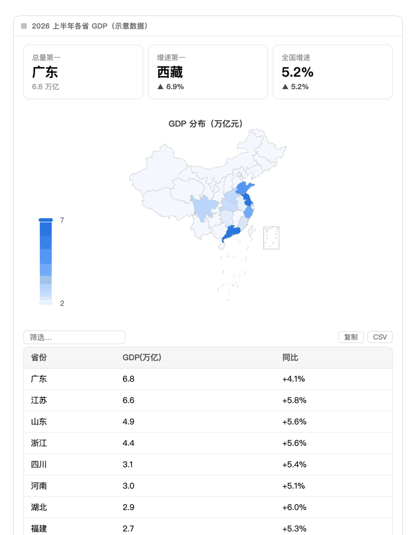

### 🍿 娱乐 —— 帮我挑部片子

> 💬 "周末想看悬疑片，帮我挑一部"

**命中目的：浏览。** 推荐以 `Grid` 一片一卡呈现，配评分 `Tag`。"查看详情"是**查询按钮**——无输入组件的卡永不锁定，可以反复点。卡片下方的 `Suggestions` 追问 chips 点一下即作为你的下一条消息发出。

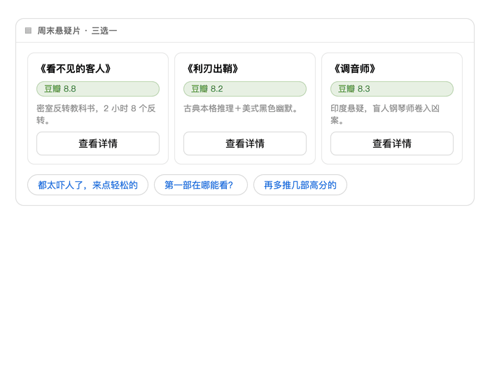

---

## 第二部分 · 能力特写

### 表单：下拉、多选、预选中、禁用

> 💬 "做个课程报名表：姓名输入、城市下拉（单选，默认北京）、方向下拉（多选，最多 2 个）、协议勾选"

`Select` 支持单选（存值）与多选（存数组，`maxAllowedSelections` 限数）、选项描述、选项级禁用、`dataModel` 预选中。提交是多行自然语言：

```
提交报名
城市：上海
方向：后端开发、数据分析
同意协议：是
```

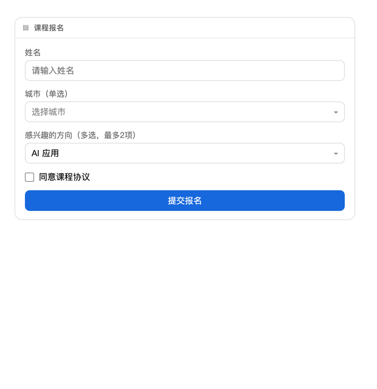

### 图表与仪表盘

> 💬 "画一个 2×2 运营看板：访问量折线、订单柱状、渠道占比环形、转化率面积图"

`Chart` 透传标准 ECharts option；`Grid columns: 2` 即成仪表盘。每张图都带 PNG 下载按钮。

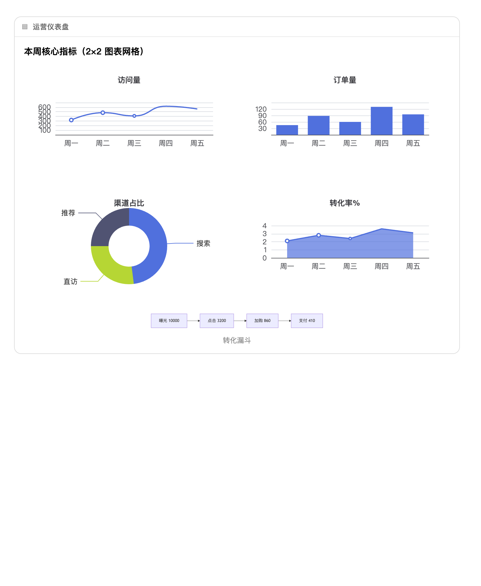

### 数学函数绘图

> 💬 "画出 y=tan(x)、cot(x)、sec(x)、csc(x)"

模型只写表达式（`functions: [{"expr": "tan(x)"}]`），内置**安全表达式求值器**（白名单函数、非 eval）自动采样 ~400 点并在渐近线断线——模型从不手工枚举数据点。把 `params` 绑到 `Slider` 上，拖动滑杆曲线实时重绘。

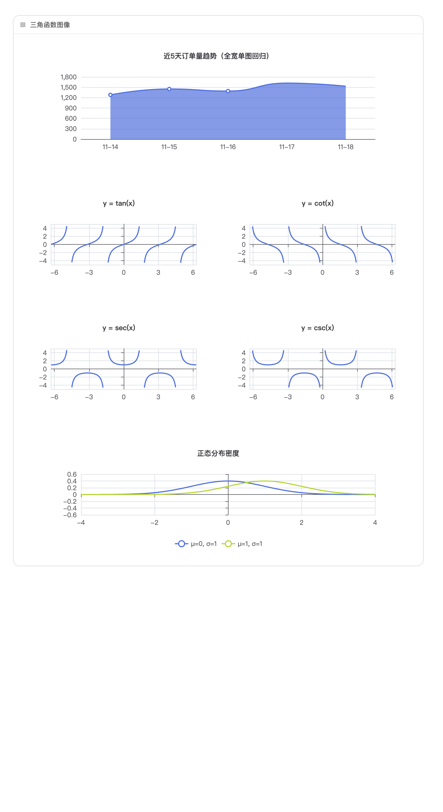

### 图示（Mermaid）与公式（KaTeX）

> 💬 "画一个用户注册流程图和一个前端技能思维导图" / "展示正态分布密度函数"

`Mermaid` 覆盖 flowchart、mindmap、sequenceDiagram、gantt、pie、stateDiagram，主题自动适配。`Math` 渲染 LaTeX（字体内联、零外部请求）；矩阵强制公式化渲染——目录禁止在文本里写裸数组。所有文本位置（选项、单元格、解说）都支持行内 `$...$` 公式。

明暗双主题组合渲染：

| 浅色 | 深色 |
|---|---|
| 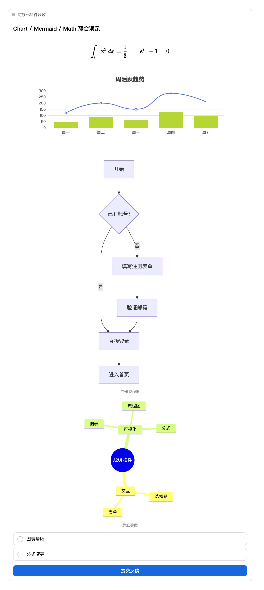 | 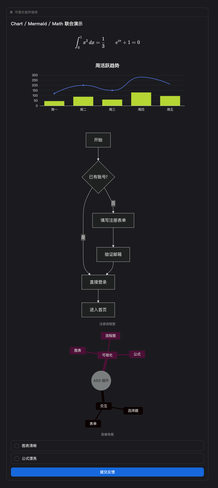 |

### 算法动画 · 数组/柱状形态

> 💬 "把快速排序 [7,2,9,4,1,8,3] 的过程演示给我"

模型把算法模拟成逐帧状态，插件以平滑渐变柱播放：橙色=正在比较/交换，绿色=已归位，配逐帧解说、进度条、图例。**每卡每页签只自动播一遍**（组件重挂载不重播），↻ 手动重播，含暂停/单步/重置。

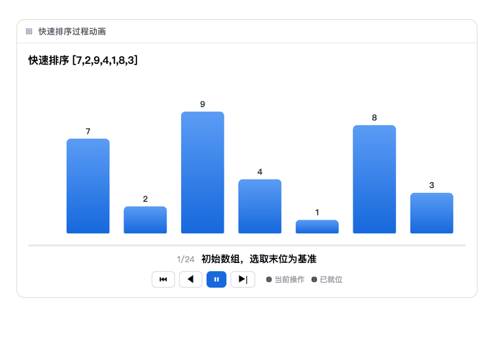

### 算法动画 · 网格/矩阵形态

> 💬 "演示矩阵乘法 [[2,1],[0,3]] × [[1,4],[5,2]] 的计算过程"

多个矩阵并排、逐格计算：橙色=正在读的行列，绿色=正在写的格，每帧配算式。图/树形态（BFS/DFS，自动圆形布局）同样自动识别。

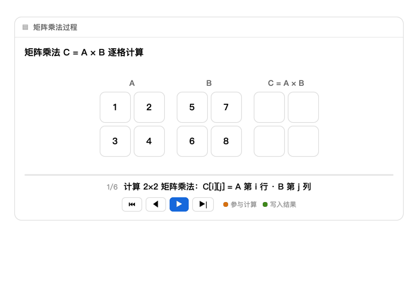

### 表单待办、草稿与防丢记录

会话里出现表单卡时，右缘停靠一个 dsh 风格的面板开关（角标=待填数，轻微脉冲提醒）。抽屉分两个页签：**待提交**列出未交表单——每卡已填计数（已填 2/6）、已填内容预览、会话时间，行内可标记「无需填写」（可恢复）；**全部**完整列出会话中每条用户消息（不省略、可换行、带日期时间），点击任意行滚动定位并高亮，老消息自动触发「加载更早」重试；表单挂在对应消息下方实时标注状态。草稿边填边存、刷新不丢；已提交状态即使清了浏览器缓存也能从会话记录重建。

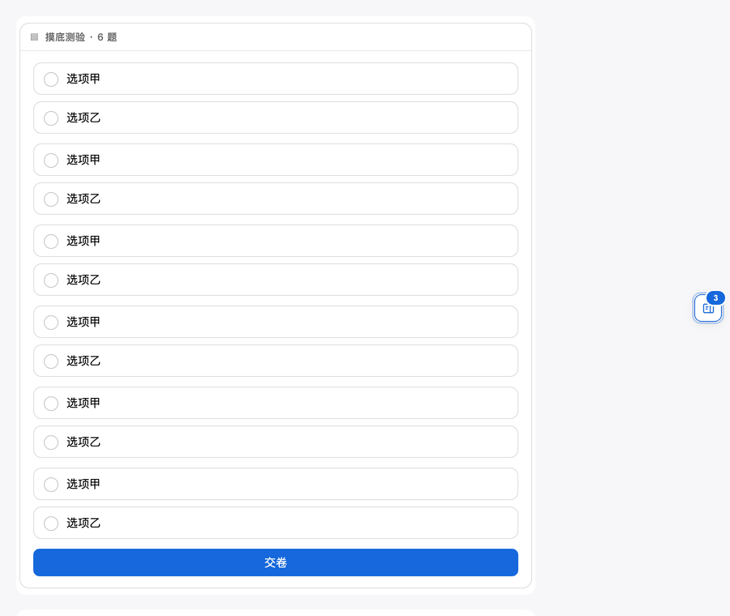

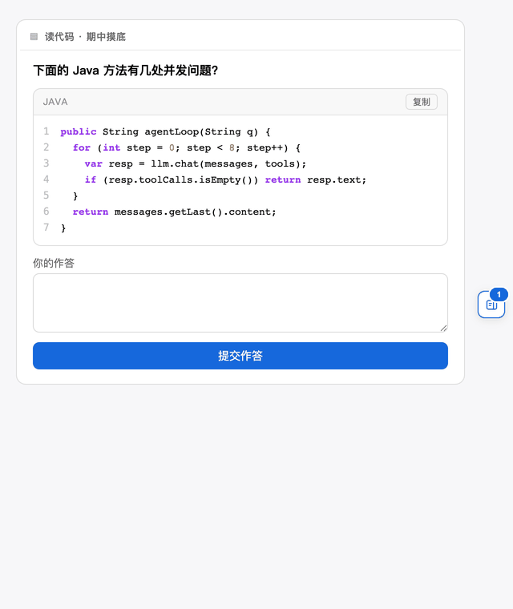

### 全屏放大

悬停出现 ⛶ → 全屏自动适配视口 → 滚轮缩放（0.2×–10×）+ 拖拽平移 → Esc/✕ 退出。图表在全屏尺寸下重新渲染（矢量级清晰）。

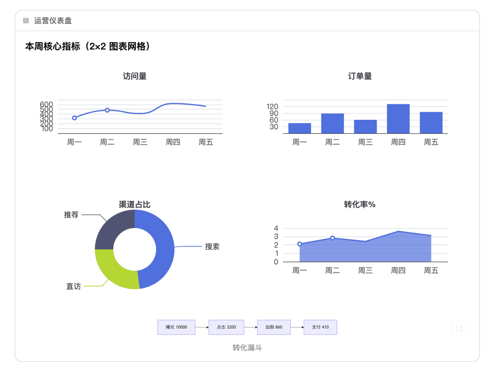

---

## 一站式提示词清单

把下面这些按顺序发给 dsh 即可复现第一部分——没有一句提到 UI：

1. 给我出一道微积分小题练练手
2. 周末想去莫干山泡温泉，帮我订个民宿
3. 盯一下我们三家竞品这周的价格变化，整理个汇总
4. 我想看一些2026年上半年各省GDP
5. 周末想看悬疑片，帮我挑一部

第二部分：报名表单 / 2×2 运营看板 / 画 tan·cot·sec·csc / 注册流程图+技能导图 / 快排动画 / 矩阵乘法动画。
